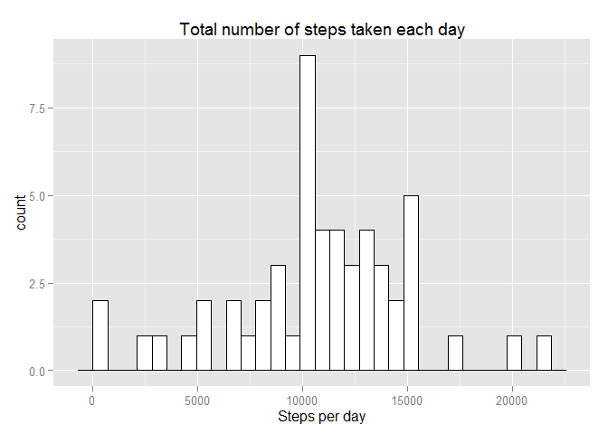
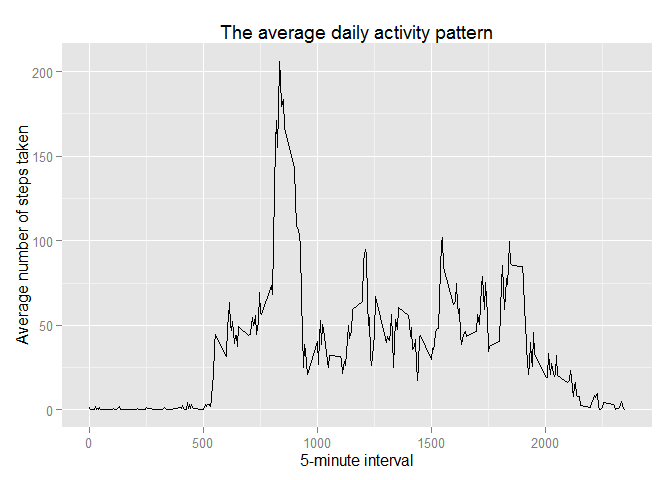
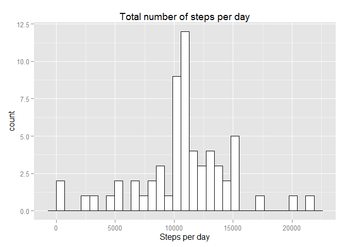
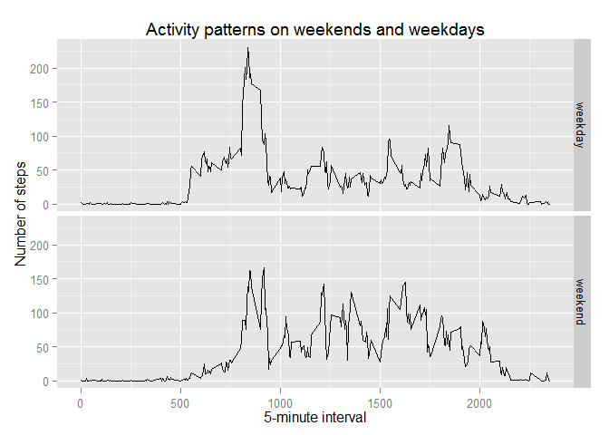

# Reproducible Research: Peer Assessment 1
## Loading required packages
For this assignment they it is required the following packages: plyr and ggplot2

```r
require(plyr)
```

```
## Loading required package: plyr
```

```r
require(ggplot2)
```

```
## Loading required package: ggplot2
```


## Loading and preprocessing the data

Loading the data from "https://d396qusza40orc.cloudfront.net/repdata%2Fdata%2Factivity.zip":

```r
if(!file.exists("activity.zip")) {
        temp <- tempfile()
        download.file("http://d396qusza40orc.cloudfront.net/repdata%2Fdata%2Factivity.zip",temp)
        unzip(temp)
        unlink(temp)
}

dataActivity <- read.csv("activity.csv")
```

These are the first records of the data:

```r
head(dataActivity)
```

```
##   steps       date interval
## 1    NA 2012-10-01        0
## 2    NA 2012-10-01        5
## 3    NA 2012-10-01       10
## 4    NA 2012-10-01       15
## 5    NA 2012-10-01       20
## 6    NA 2012-10-01       25
```

Preprocessing the data to convert the column "date" for the type of data date:

```r
dataActivity$date <- as.Date(dataActivity$date)
```


## What is mean total number of steps taken per day?
Ignoring the __missing values__ in the data_activity dataset:

```r
dataActivity_noNA <- dataActivity[which(dataActivity$steps != "NA"), ]
```
These are the first records of the clean data:

```r
head(dataActivity_noNA)
```

```
##     steps       date interval
## 289     0 2012-10-02        0
## 290     0 2012-10-02        5
## 291     0 2012-10-02       10
## 292     0 2012-10-02       15
## 293     0 2012-10-02       20
## 294     0 2012-10-02       25
```
__Histogram__ of the total number of steps taken each day

```r
stepsPerDay <- ddply(dataActivity_noNA, ~date, summarise, steps = sum(steps))
hist <- ggplot(stepsPerDay, aes(steps))
hist <- hist + geom_histogram(fill = "white", color = "black")
hist <- hist + ggtitle("Total number of steps taken each day")
hist + xlab("Steps per day")
```

```
## stat_bin: binwidth defaulted to range/30. Use 'binwidth = x' to adjust this.
```

 


The __mean__ and __median__ total number of steps taken per day

The mean:

```r
meanStepsPerDay <- mean(stepsPerDay$steps, na.rm = TRUE)
meanStepsPerDay
```

```
## [1] 10766
```

The median:

```r
medianStepsPerDay <- median(stepsPerDay$steps, na.rm = TRUE)
medianStepsPerDay
```

```
## [1] 10765
```


## What is the average daily activity pattern?

Calculating  the average number of steps taken (averaged across all days):

```r
avgStepsPerInterval <- aggregate(x = list(steps = dataActivity$steps), 
                                 by = list(interval = dataActivity$interval),
                                 FUN = mean, na.rm = TRUE)
```
These are the first records of the average number of steps taken:

```r
head(avgStepsPerInterval)
```

```
##   interval   steps
## 1        0 1.71698
## 2        5 0.33962
## 3       10 0.13208
## 4       15 0.15094
## 5       20 0.07547
## 6       25 2.09434
```

This is  time series plot of the 5-minute interval (x-axis) and the average number of steps taken, averaged across all days (y-axis):

```r
plotTimeSerie <- ggplot(data = avgStepsPerInterval, aes(x = interval, y = steps)) + geom_line() 
plotTimeSerie <- plotTimeSerie + ggtitle("The average daily activity pattern")
plotTimeSerie + xlab("5-minute interval") + ylab("Average number of steps taken")
```

 

Which 5-minute interval, on average across all the days in the dataset, contains the maximum number of steps?

```r
maxInterval <- avgStepsPerInterval[which.max(avgStepsPerInterval$steps), ]
maxInterval
```

```
##     interval steps
## 104      835 206.2
```


## Imputing missing values


Total number of missing values in the dataset: 

```r
sum(is.na(dataActivity$steps))
```

```
## [1] 2304
```

Filling in all of the missing values in the dataset with the mean value of its 5-minute interval:

```r
fillValue <- function(steps, interval) {
    filled <- NA
    if (!is.na(steps)) 
        filled <- c(steps) else filled <- (avgStepsPerInterval[avgStepsPerInterval$interval == interval, "steps"])
    return(filled)
}
filledDataActivity <- dataActivity
filledDataActivity$steps <- mapply(fillValue, dataActivity$steps, dataActivity$interval)
```

Histogram of the total number of steps taken each day:

```r
totalStepsPerDay <- ddply(filledDataActivity, ~date, summarise, steps = sum(steps))
plotTotalSteps <- ggplot(totalStepsPerDay, aes(steps))
plotTotalSteps <- plotTotalSteps + geom_histogram(fill = "white", color = "black")
plotTotalSteps <- plotTotalSteps + ggtitle("Total number of steps per day")
plotTotalSteps + xlab("Steps per day")
```

```
## stat_bin: binwidth defaulted to range/30. Use 'binwidth = x' to adjust this.
```

 

The mean total number of steps taken per day:

```r
mean(totalStepsPerDay$steps)
```

```
## [1] 10766
```


The median total number of steps taken per day:

```r
median(totalStepsPerDay$steps)
```

```
## [1] 10766
```

What is the impact of imputing missing data on the estimates of the total daily number of steps?
The mean did not change and the median almost did not change (before: 10765,after: 19766). The impact can be considered negligible.

## Are there differences in activity patterns between weekdays and weekends?

It used the dataset with the filled-in missing values in this part.


Creating a new factor variable in the dataset with two levels - "weekday" and "weekend" indicating whether a given date is a weekday or weekend day:


```r
daytype <- function(date) {
    if (weekdays(as.Date(date)) %in% c("Saturday", "Sunday")) {
        "weekend"
    } else {
        "weekday"
    }
}
filledDataActivity$daytype <- as.factor(sapply(filledDataActivity$date, daytype))
```
These are the first records of the new data set:

```r
head(filledDataActivity)
```

```
##     steps       date interval daytype
## 1 1.71698 2012-10-01        0 weekday
## 2 0.33962 2012-10-01        5 weekday
## 3 0.13208 2012-10-01       10 weekday
## 4 0.15094 2012-10-01       15 weekday
## 5 0.07547 2012-10-01       20 weekday
## 6 2.09434 2012-10-01       25 weekday
```

Creating a panel plot containing a time series plot of the 5-minute interval (x-axis) and the average number of steps taken, averaged across all weekday days or weekend days (y-axis):


```r
avgSteps <- aggregate(steps ~ interval + daytype, data = filledDataActivity, mean)
plotWeekDayEnd <- ggplot(avgSteps, aes(interval, steps)) + geom_line() + facet_grid(daytype ~ .)
plotWeekDayEnd <- plotWeekDayEnd + ggtitle("Activity patterns on weekends and weekdays")
plotWeekDayEnd + xlab("5-minute interval") + ylab("Number of steps")
```

 

